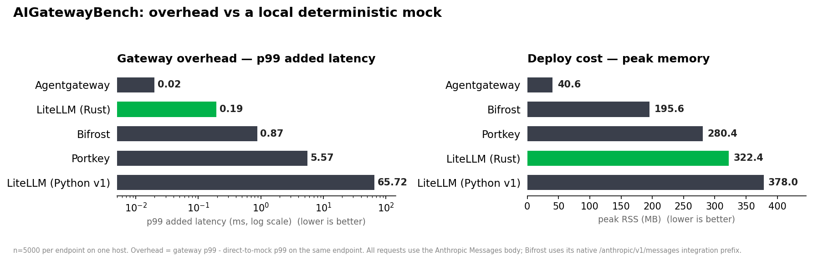
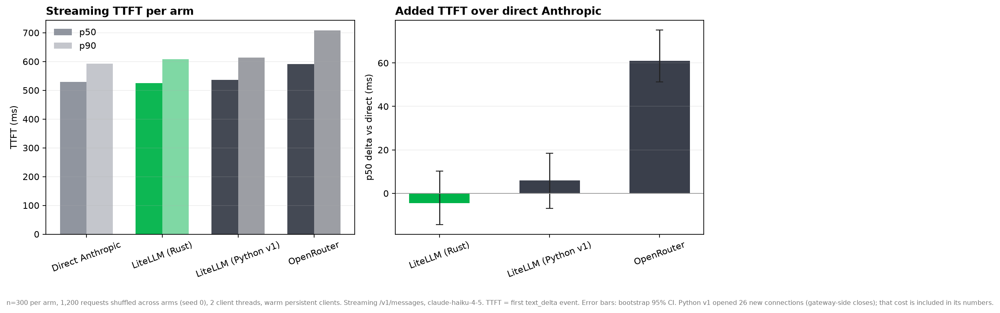

# AIGatewayBench

A reproducible benchmark for **AI-gateway overhead**: the latency, memory, and resource cost a gateway adds on top of the upstream LLM, measured through the lens of a coding agent.

Every gateway points at the same local deterministic mock, so provider latency and network noise are removed and what's left is the gateway's own overhead:

```
overhead = latency(client -> gateway -> mock) - latency(client -> mock directly)
```

Gateways compared: LiteLLM (Rust), LiteLLM (Python v1), Portkey, Bifrost, and OpenRouter (hosted, real-model scenario only).




The cost chart estimates gateway request cost from measured CPU, peak RSS, and sustained throughput.


The session chart replays deterministic Claude Code and Codex-style control loops with non-streaming requests for apples-to-apples comparison.


The concurrency chart uses a persistent Rust reqwest driver and retains points with a controlled direct baseline.


The TTFT chart includes streaming-capable gateways and labels unavailable streaming routes explicitly.


The RPS-per-dollar chart uses the highest retained throughput point and measured CPU and peak RSS.

## What it tests

Each scenario is one folder under `scenarios/`. Load/streaming scenarios use Locust; the rest are plain Python scripts.

| Metric | Why it matters for agents | Folder |
|---|---|---|
| TTFT + inter-chunk latency & jitter | An agent streams every turn; buffering or stutter is felt directly | `scenarios/streaming_turn` |
| Tool-call latency + argument-delta reassembly | Tool calls are the heavy path; reordered/mangled args break an edit | `scenarios/tool_call_loop` |
| Overhead vs prompt size (1k/10k/100k) | Agents paste whole files; parse/serialize cost grows with context | `scenarios/large_context` |
| p99 inter-chunk latency + chunk fidelity under load | The moat metric: does the tail stay flat and 1:1 as concurrency rises | `scenarios/concurrent_agents` |
| Edge rejection of invalid/rotating keys | An abusive key flood should be rejected cheaply, not hit the upstream | `scenarios/security_key_flood` |
| Failover / error-path overhead | Cost of the retry/fallback path when the upstream returns 429/500 | `scenarios/failover_overhead` |
| Head-of-line blocking | Does one 100k-token request stall small streaming turns | `scenarios/head_of_line` |
| Peak RSS, idle RSS, memory growth | How cheap to deploy, and whether it drifts toward OOM under load | `tools/mem_sampler.py` (run alongside any scenario) |

See [`docs/WHAT_THE_BENCH_TESTS.md`](docs/WHAT_THE_BENCH_TESTS.md) for the full rationale and the moat-metric argument.

## Running it

```bash
python -m venv .venv && . .venv/bin/activate && pip install -r requirements.txt

# 1. start the deterministic Rust mock upstream
cargo run --release -p mock-upstream

# 2. start a gateway pointed at the mock (see gateways/<name>/README.md)

# 3. run a scenario, e.g. a Locust load test
locust -f scenarios/streaming_turn/locustfile.py --headless -u 16 -r 16 -t 30s \
  --host http://127.0.0.1:<gateway-port>

# 4. regenerate the chart from results/
python analyze/make_chart.py
```

Per-gateway setup (how to start each and point it at the mock) is in `gateways/<name>/README.md`. Measured results land in `results/`; chart source values are committed CSVs under `results/`.

## Results

The charts are generated from real local runs against the fast Rust mock using a persistent Rust reqwest load driver for concurrency and throughput. The direct baseline remained controlled through concurrency 64; concurrency 256 was dropped because its p99 exceeded twice the single-client floor. Raw per-run data is in `results/`. Portkey OSS currently returns HTTP 500 for streaming Anthropic Messages requests.

## Hosted gateways (real model)

OpenRouter cannot point at the local mock, so it is measured in a separate real-model scenario: streaming `/v1/messages` to claude-haiku-4-5, 300 requests per arm, 1,200 requests shuffled across arms, 2 client threads, warm persistent clients. TTFT is the first `text_delta` event. Both LiteLLM arms are within noise of direct Anthropic; OpenRouter adds 61 ms at p50 (95% CI 51 to 75) over direct. See [`scenarios/hosted_gateways/README.md`](scenarios/hosted_gateways/README.md) for the method

| Arm | TTFT p50 (ms) | TTFT p90 (ms) | TTFT p99 (ms) | Full response p50 (ms) | p50 delta vs direct (ms) | 95% CI | Permutation p | Errors |
|---|---|---|---|---|---|---|---|---|
| Direct Anthropic | 529.7 | 593.2 | 702.6 | 581.3 | | | | 0 |
| LiteLLM (Rust) | 525.2 | 608.0 | 707.2 | 582.0 | -4.5 | [-14.3, 10.3] | 0.6486 | 0 |
| LiteLLM (Python v1) | 535.6 | 614.1 | 712.1 | 594.4 | +5.9 | [-7.0, 18.5] | 0.3544 | 0 |
| OpenRouter | 590.7 | 708.2 | 876.5 | 664.3 | +61.0 | [51.3, 75.2] | 0.0001 | 0 |

OpenRouter's own overhead estimate (client TTFT minus its self-reported upstream `latency` field, an estimate since OpenRouter does not formally define the field): p50 30.4 ms, p90 76.4 ms



## Cost estimate

The request-cost estimate is derived as: estimated USD per 1M requests = ((average CPU fraction × USD per vCPU-hour) + (peak RSS in GB × USD per GB-hour)) divided by sustained throughput, then scaled to 1,000,000 requests. The model uses USD 0.04 per vCPU-hour, USD 0.005 per GB-hour, and a standard 4 vCPU / 16 GB instance. It is an estimate based on local CPU and RSS samples, not a provider invoice.

## Data provenance

Every chart in `analyze/` is generated from a committed CSV in `results/` containing the exact plotted values. Chart scripts must not hardcode numbers.
